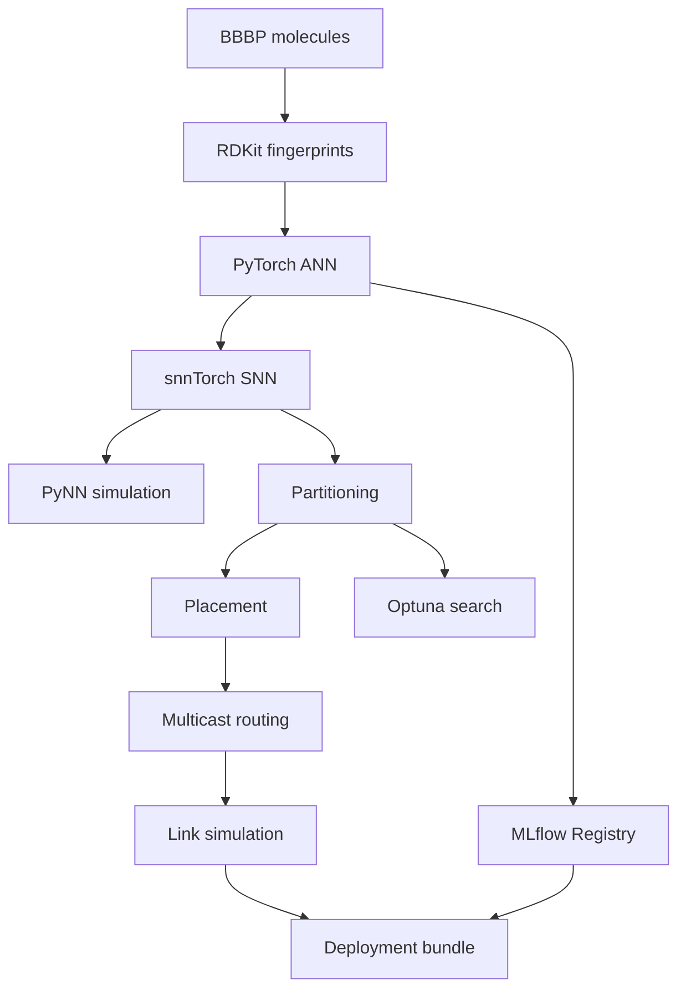

# NeuroRoute

**Neuromorphic model conversion, placement, multicast routing, and MLOps**

[](https://www.python.org/)
[](https://pytorch.org/)
[](https://mlflow.org/)
[](https://dvc.org/)
[](#testing)

NeuroRoute is an end-to-end experimental pipeline for converting a molecular
classification ANN into a spiking neural network and studying its deployment
on a SpiNNaker-style neuromorphic architecture.

It combines machine learning, spiking simulation, graph partitioning,
connectivity-aware placement, multicast routing, traffic simulation, and MLOps
in one reproducible project.

---

## Highlights

| Capability | Implementation |
|---|---|
| Molecular data | BBBP validation and RDKit fingerprints |
| Artificial neural network | PyTorch binary classifier |
| Spiking neural network | ANN-to-SNN conversion with snnTorch |
| Neural simulation | PyNN with the Brian2 backend |
| SpiNNaker integration | sPyNNaker and PACMAN virtual-board mapping |
| Deployment planning | Partitioning and connectivity-aware placement |
| Network routing | Mesh routes and multicast route trees |
| Hardware simulation | Router limits, bandwidth, queues, latency and drops |
| Optimization | Optuna hyperparameter search |
| MLOps | MLflow tracking, artifacts and Model Registry |
| Data versioning | DVC-tracked raw and processed data |
| Verification | 47 automated tests |

## Architecture



## Results

### Model performance

| Model | Accuracy | ROC-AUC | Precision | Recall | F1 |
|---|---:|---:|---:|---:|---:|
| PyTorch ANN | **0.8660** | **0.9143** | 0.9447 | 0.8761 | **0.9091** |
| Converted SNN | 0.7124 | 0.9055 | 0.9679 | 0.6453 | 0.7744 |

### Placement comparison

| Metric | Round-robin | Connectivity-aware | Improvement |
|---|---:|---:|---:|
| Used chips | 16 | **10** | 37.50% fewer |
| Independent unicast hops | 310 | **72** | 76.77% fewer |
| Multicast tree links | 152 | **72** | 52.63% fewer |
| Maximum router entries | 35 | 36 | Within capacity |
| Maximum link route load | 24 | 24 | Unchanged |

Connectivity-aware placement substantially reduced communication distance
without causing router overflow.

### Link simulation

| Metric | Result |
|---|---:|
| Active directed links | 22 |
| Source packets | 21,054.69 |
| Link transmissions | 93,003.30 |
| Peak link utilization | 15.36% |
| Average route latency | 0.408 ms |
| Maximum route latency | 0.666 ms |
| Maximum queue | 0 packets |
| Dropped packets | **0** |
| Overloaded links | **0** |

### Best partition configuration

| Parameter | Value |
|---|---:|
| Neurons per core | 64 |
| Application cores per chip | 7 |
| Used chips | 3 |
| Machine vertices | 20 |
| Multicast tree links | 14 |
| Maximum router entries | 19 |
| Router overflow events | 0 |
| Objective score | 55.25 |

## Quick start

### 1. Create the main environment

```cmd
py -3.11 -m venv .venv
.venv\Scripts\activate
python -m pip install --upgrade pip setuptools wheel
python -m pip install -r requirements-lock.txt
```

### 2. Start MLflow

```cmd
start "NeuroRoute MLflow" cmd /K "call .venv\Scripts\activate && mlflow server --backend-store-uri sqlite:///mlflow.db --default-artifact-root ./mlartifacts --host 127.0.0.1 --port 5000"
```

Open `http://127.0.0.1:5000` in a browser.

### 3. Run the core pipeline

```cmd
python -m src.neuroroute.data_prep --config configs\baseline.yaml
python -m src.neuroroute.train_ann --config configs\baseline.yaml
python -m src.neuroroute.convert_snn --config configs\snn.yaml
python -m src.neuroroute.partition_compare
python -m src.neuroroute.link_sim --config configs\hardware.yaml
python -m src.neuroroute.validate_deployment
```

### 4. Run the tests

```cmd
pytest -v
```

Expected result:

```text
47 passed
```

## SpiNNaker environment

sPyNNaker is isolated from the main ML dependencies:

```cmd
py -3.11 -m venv .venv-spinnaker
.venv-spinnaker\Scripts\activate
python -m pip install -r requirements-spinnaker-lock.txt
```

The project demonstrates:

- PyNN simulation through Brian2
- Official sPyNNaker installation
- Virtual SpiNNaker-5 board setup
- PACMAN partitioning and mapping
- SpiNNaker toolchain readiness checks

## MLOps workflow


MLflow records parameters, metrics, models, plots, optimization trials,
partitioning comparisons, and deployment events. The ANN is registered as
`NeuroRoute-BBBP-ANN` and promoted with the `candidate` and `champion` aliases.

## Project structure

```text
neuroroute/
|-- configs/                     Experiment and hardware configuration
|-- data/                        DVC-managed datasets
|-- src/neuroroute/              Application source code
|   |-- data_prep.py             BBBP preprocessing
|   |-- train_ann.py             ANN training
|   |-- convert_snn.py           SNN conversion
|   |-- pynn_demo.py             PyNN/Brian2 demonstration
|   |-- partition_sim.py         Population partitioning
|   |-- placement.py             Placement algorithms
|   |-- routing.py               Point-to-point routing
|   |-- multicast.py             Multicast route trees
|   |-- link_sim.py              Bandwidth and timing simulation
|   |-- hpo_partition.py         Optuna optimization
|   |-- promote_model.py         MLflow model promotion
|   |-- package_deployment.py    Deployment packaging
|   `-- validate_deployment.py   Deployment validation
|-- tests/                       Automated tests
|-- requirements-lock.txt
|-- requirements-spinnaker-lock.txt
`-- README.md
```

## Testing

The 47-test suite covers:

- Data validation and deterministic splitting
- ANN outputs and saved artifacts
- Partition and placement constraints
- Mesh routing and boundary behavior
- Multicast tree correctness
- Link bandwidth and latency calculations
- Queues and packet drops

## Scope and limitations

- The project was not run on physical SpiNNaker hardware because an authorized
  board or spalloc account was unavailable.
- Official virtual mapping targets the installed SpiNNaker-5 toolchain.
- The custom router model is an architectural simulator, not a cycle-accurate
  or bit-exact SpiNNaker2 implementation.
- ANN and SNN experiments use CPU execution.
- BBBP is the current demonstration dataset.

## Future work

- Execute through an authorized spalloc service
- Compare simulation estimates with hardware counters
- Add cycle-level router arbitration
- Add fault-aware placement and rerouting
- Support more molecular datasets
- Add continuous integration and container deployment

## License

This project is intended for educational and research use.

---

**NeuroRoute: from neural models to neuromorphic routes.**
